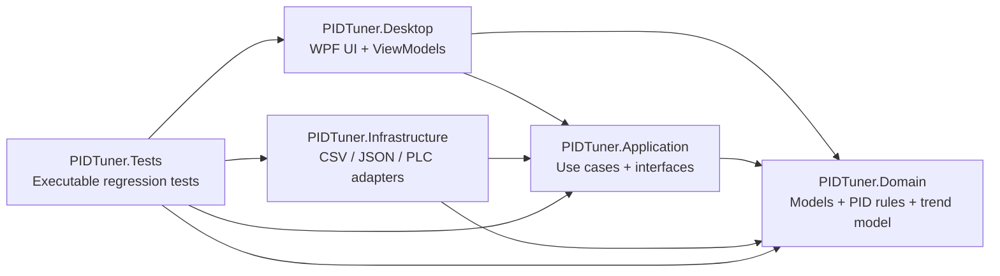

# PIDTuner Implementation Notes

This document is for engineers who need to read, maintain, or extend PIDTuner. It explains the top-level architecture, the main modules, the important technical details, and the module/local comments added to the code. The Chinese version is `IMPLEMENTATION_NOTES.zh-CN.md`.

## Architecture

PIDTuner uses a layered architecture: domain rules stay inward, while UI, files, CSV, and PLC communication are adapters around those rules.



Project responsibilities:

- `src/PIDTuner.Domain`: domain models, PID metrics, recommendation rules, trend models, and PLC configuration records.
- `src/PIDTuner.Application`: use cases and ports such as CSV exchange, PLC snapshot reading, and repository interfaces.
- `src/PIDTuner.Infrastructure`: adapters for files, CSV, JSON, Siemens S7, and preview data.
- `src/PIDTuner.Desktop`: WPF UI, commands, view models, notifications, and local recording persistence.
- `tests/PIDTuner.Tests`: executable regression tests without a test framework dependency.

## Key Implementation Points

### 1. Offline PID Analysis

`BasicPidAnalysisService` contains the core offline step-response metric calculation. It depends only on domain models, so it can be reused for imported CSV, saved history, and future live captures.

Comment locations:

- `src/PIDTuner.Infrastructure/Analysis/BasicPidAnalysisService.cs:8`
- `src/PIDTuner.Infrastructure/Analysis/BasicPidAnalysisService.cs:18`
- `src/PIDTuner.Infrastructure/Analysis/BasicPidAnalysisService.cs:122`
- `src/PIDTuner.Infrastructure/Analysis/BasicPidAnalysisService.cs:178`

Code excerpt:

```csharp
/// <summary>
/// Offline PID step-response analyzer. It keeps the math independent from UI and file formats
/// so the same metrics can be reused for imported CSV, saved history, and future live captures.
/// </summary>
public sealed class BasicPidAnalysisService : IPidAnalysisService
{
    public PidResponseMetrics Analyze(IReadOnlyList<PidSample> samples, AnalysisWindow window)
    {
        // Analysis operates only on samples that contain both SP and PV inside the requested window.
        var selected = samples
            .Where(sample => window.Contains(sample.Timestamp))
            .Where(sample => sample.SetPoint.HasValue && sample.ProcessValue.HasValue)
            .OrderBy(sample => sample.Timestamp)
            .ToArray();
    }
}
```

Design details:

- Overshoot, rise time, and settling time are calculated from the SP/PV step response.
- Error integration uses trapezoidal integration, which works with uneven sample spacing.
- A flat setpoint does not produce artificial rise time or overshoot values, but still produces useful error metrics.

### 2. Configurable CSV Field Mapping

CSV parsing is driven by `PidSampleFieldProfile` instead of fixed column names. Each PID tuning project can rename or add CSV columns through configuration, while project-level metadata is still preserved.

Comment locations:

- `src/PIDTuner.Infrastructure/Csv/ConfigurablePidSampleCsvExchange.cs:10`
- `src/PIDTuner.Infrastructure/Csv/ConfigurablePidSampleCsvExchange.cs:17`
- `src/PIDTuner.Infrastructure/Csv/ConfigurablePidSampleCsvExchange.cs:26`
- `src/PIDTuner.Infrastructure/Csv/ConfigurablePidSampleCsvExchange.cs:88`

Code excerpt:

```csharp
/// <summary>
/// CSV adapter driven by a field profile. The profile lets each PID project rename or add
/// columns without changing the domain model or the analysis use case.
/// </summary>
public sealed class ConfigurablePidSampleCsvExchange(PidSampleFieldProfile fieldProfile) : ICsvSampleExchange
{
    public async Task<IReadOnlyList<PidSample>> ImportAsync(Stream csvStream, CancellationToken cancellationToken)
    {
        // Accept UTF-8 with or without BOM; exports intentionally include BOM for spreadsheet compatibility.
        using var reader = new StreamReader(csvStream, Encoding.UTF8, detectEncodingFromByteOrderMarks: true, leaveOpen: true);
    }
}
```

Technical details:

- Import accepts UTF-8 with or without BOM.
- Export intentionally writes a UTF-8 BOM to reduce mojibake when Chinese CSV files are opened in Excel.
- Header lookup is case-insensitive.
- `Metadata` and PID parameter columns are preserved in `PidSample.ExtraFields`.

### 3. PLC Configuration And Real-Time Monitoring

PLC project configuration is represented by `PlcProjectConfiguration`. Important fields include:

- `ipAddress`, `rack`, `slot`, `timeoutMilliseconds`
- `defaultSamplingMilliseconds`
- `minimumSamplingMilliseconds`
- `tags[].samplingInterval`

Repeated monitoring uses `defaultSamplingMilliseconds`, bounded by `minimumSamplingMilliseconds`. One-second recording uses the fastest enabled tag `samplingInterval`, also bounded by `minimumSamplingMilliseconds`.

### 4. Siemens S7 Communication

The low-level S7 implementation lives in `SiemensS7Client`. It owns ISO-on-TCP connection setup, S7 setup communication, DB read request construction, and response parsing.

Comment locations:

- `src/PIDTuner.Infrastructure/Plc/SiemensS7Client.cs:9`
- `src/PIDTuner.Infrastructure/Plc/SiemensS7Client.cs:26`
- `src/PIDTuner.Infrastructure/Plc/SiemensS7Client.cs:121`
- `src/PIDTuner.Infrastructure/Plc/SiemensS7Client.cs:160`

Code excerpt:

```csharp
/// <summary>
/// Minimal Siemens S7 TCP client for DB reads. It owns the socket/session handshake and exposes
/// typed numeric reads to higher-level snapshot readers.
/// </summary>
public sealed class SiemensS7Client : IAsyncDisposable
{
    public async Task ConnectAsync(PlcProjectConfiguration configuration, CancellationToken cancellationToken)
    {
        // ISO-on-TCP connection request, followed by S7 setup communication negotiation.
        await SendAsync(BuildConnectionRequest(configuration.Rack, configuration.Slot), timeout.Token);
        _ = await ReceiveAsync(timeout.Token);
        await SendAsync(BuildSetupCommunicationRequest(), timeout.Token);
        _ = await ReceiveAsync(timeout.Token);
    }
}
```

Current S7 scope:

- DB bit, byte, word, and double-word address parsing.
- Boolean, Int16, Int32, Float, and numeric Double display reads.
- Multi-tag reads use Siemens S7 multi-variable read PDUs. `SiemensS7Client` splits requests into batches of up to 16 items, constructs one S7ANY descriptor per tag, and unpacks each returned data item back into a per-tag result.
- Connection checks now distinguish TCP 102 connection failures, ISO-on-TCP handshake failures, and S7 Setup Communication failures. Timeout failures caused by the configured PLC timeout are reported as communication-stage failures instead of user cancellation.

### 5. High-Frequency One-Second Recording And Connection Reuse

To remove per-frame connection cost during 50 ms recording, the project added session-based snapshot reading:

- `IPlcTagSnapshotSessionReader`
- `IPlcTagSnapshotReadSession`

`RecordPlcOneSecondAsync()` opens one read session and reuses it for the whole one-second recording window.

Comment locations:

- `src/PIDTuner.Infrastructure/Plc/SiemensS7PlcTagSnapshotReader.cs:8`
- `src/PIDTuner.Infrastructure/Plc/SiemensS7PlcTagSnapshotReader.cs:35`
- `src/PIDTuner.Infrastructure/Plc/SiemensS7PlcTagSnapshotReader.cs:61`
- `src/PIDTuner.Desktop/ViewModels/MainWindowViewModel.cs:815`
- `src/PIDTuner.Desktop/ViewModels/MainWindowViewModel.cs:833`

Code excerpt:

```csharp
// Open one reader session for the whole recording window to avoid per-frame PLC reconnect cost.
await using var session = await OpenPlcSnapshotSessionAsync(configuration, CancellationToken.None);
while (nextDue < TimeSpan.FromSeconds(1))
{
    var wait = nextDue - stopwatch.Elapsed;
    if (wait > TimeSpan.Zero)
    {
        await Task.Delay(wait);
    }

    var snapshots = await session.ReadAsync(CancellationToken.None);
    frames.Add(snapshots);
    ApplyPlcMonitorSnapshots(snapshots);
    // Absolute scheduling targets 0ms, N ms, 2N ms... instead of "read duration + delay".
    nextDue += TimeSpan.FromMilliseconds(intervalMilliseconds);
}
```

This has two effects:

- Recording no longer reconnects to the PLC for every frame.
- Scheduling uses absolute due times such as `0ms, 50ms, 100ms...` instead of `read duration + delay`.

If a real PLC still cannot reach `1000 / interval` frames, the bottleneck is now usually PLC response time, network latency, enabled tag count, or the configured batch count. Sequential per-tag S7 read PDUs are no longer used inside a session frame.

### 6. Local Persistence And User Feedback

Current persistence uses local JSON files:

- Test sessions: `local/test-sessions`
- PID parameter sets: `local/parameter-sets`
- Recommendation reviews: `local/recommendation-reviews`
- PLC one-second recordings: `local/plc-recordings`

Every save-like operation reports through the UI notification box. PLC one-second recording includes frame count, tag count, snapshot count, interval, and the absolute JSON save path.

## Test Strategy

The `tests/PIDTuner.Tests` project covers:

- PID metric calculation.
- CSV import/export and field profiles.
- PLC configuration round trips.
- S7 address parsing.
- ViewModel command behavior.
- One-second PLC recording: the 50 ms simulation verifies near-20-frame capture and verifies that only one read session is opened during recording.

Run:

```powershell
$env:DOTNET_CLI_HOME = (Get-Location).Path
dotnet run --project .\tests\PIDTuner.Tests\PIDTuner.Tests.csproj
```

## Next Technical Priority

The next high-value work is recording data replay design. Siemens S7 connection reuse, multi-tag batch reading, and live ScottPlot trend visualization are now in place, and connection checks report the failing communication stage where possible.

## Live PLC Trend Visualization

The real-time monitor page now uses `ScottPlot.WPF` through a Desktop-layer adapter:

- `src/PIDTuner.Desktop/Services/PlcTrendChartAdapter.cs` keeps an in-memory per-tag trend buffer and renders visible PLC tags as multi-series lines.
- `MainWindowViewModel` raises `PlcSnapshotsApplied` after each monitor frame, keeping ScottPlot out of the ViewModel and domain layers.
- `MainWindow.xaml.cs` listens to snapshot and tag visibility changes, then refreshes the chart, applies the selected time window, and shows hover summaries.

This keeps the current PLC read path centered on `PlcTagSnapshot` while giving the UI a richer trend surface.
