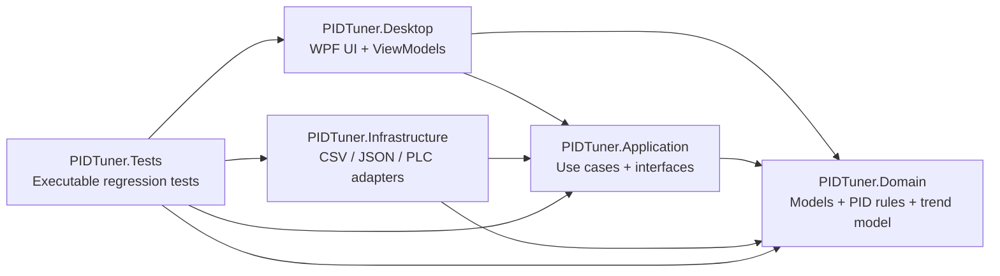

# PIDTuner 实现说明

本文面向希望阅读和继续开发 PIDTuner 的工程读者，说明项目的顶层架构、主要模块、关键技术实现，以及代码中的模块级和局部注释。对应英文版见 `IMPLEMENTATION_NOTES.en.md`。

## 架构总览

PIDTuner 采用分层架构，核心规则向内收敛，外部 IO 和 UI 向外适配：



主要项目职责：

- `src/PIDTuner.Domain`：领域模型、PID 指标、建议规则、趋势点结构、PLC 配置模型。
- `src/PIDTuner.Application`：用例和端口接口，例如 CSV 交换、PLC 点位读取、仓储接口。
- `src/PIDTuner.Infrastructure`：文件、CSV、JSON、Siemens S7、Preview 等外部适配器。
- `src/PIDTuner.Desktop`：WPF 界面、命令、ViewModel、用户反馈和本地记录保存。
- `tests/PIDTuner.Tests`：无测试框架依赖的可执行回归测试，用于验证主要行为。

## 关键实现点

### 1. 离线 PID 分析

`BasicPidAnalysisService` 是离线 PID 阶跃响应指标的核心实现。它只依赖领域模型，不关心数据来自 CSV、历史记录还是未来的实时采集。

关键注释位置：

- `src/PIDTuner.Infrastructure/Analysis/BasicPidAnalysisService.cs:8`
- `src/PIDTuner.Infrastructure/Analysis/BasicPidAnalysisService.cs:18`
- `src/PIDTuner.Infrastructure/Analysis/BasicPidAnalysisService.cs:122`
- `src/PIDTuner.Infrastructure/Analysis/BasicPidAnalysisService.cs:178`

关键代码摘录：

```csharp
/// <summary>
/// Offline PID step-response analyzer. It keeps the math independent from UI and file formats
/// so the same metrics can be reused for imported CSV, saved history, and future live captures.
/// </summary>
public sealed class BasicPidAnalysisService : IPidAnalysisService
{
    public PidResponseMetrics Analyze(IReadOnlyList<PidSample> samples, AnalysisWindow window)
    {
        // Analysis operates only on samples that contain both SP and PV inside the requested window.
        var selected = samples
            .Where(sample => window.Contains(sample.Timestamp))
            .Where(sample => sample.SetPoint.HasValue && sample.ProcessValue.HasValue)
            .OrderBy(sample => sample.Timestamp)
            .ToArray();
    }
}
```

指标设计要点：

- 超调量、上升时间、调节时间都基于 `SP/PV` 的阶跃响应计算。
- 误差积分使用梯形积分，能处理不均匀采样间隔。
- 平坦设定值场景下不会强行给出无意义的上升时间或超调量，但仍计算稳态误差和误差类指标。

### 2. 可配置 CSV 字段映射

CSV 解析不是写死列名，而是由 `PidSampleFieldProfile` 驱动。这样每个 PID 调节项目都可以在配置文件里修改 CSV 字段，并保留项目元信息。

关键注释位置：

- `src/PIDTuner.Infrastructure/Csv/ConfigurablePidSampleCsvExchange.cs:10`
- `src/PIDTuner.Infrastructure/Csv/ConfigurablePidSampleCsvExchange.cs:17`
- `src/PIDTuner.Infrastructure/Csv/ConfigurablePidSampleCsvExchange.cs:26`
- `src/PIDTuner.Infrastructure/Csv/ConfigurablePidSampleCsvExchange.cs:88`

关键代码摘录：

```csharp
/// <summary>
/// CSV adapter driven by a field profile. The profile lets each PID project rename or add
/// columns without changing the domain model or the analysis use case.
/// </summary>
public sealed class ConfigurablePidSampleCsvExchange(PidSampleFieldProfile fieldProfile) : ICsvSampleExchange
{
    public async Task<IReadOnlyList<PidSample>> ImportAsync(Stream csvStream, CancellationToken cancellationToken)
    {
        // Accept UTF-8 with or without BOM; exports intentionally include BOM for spreadsheet compatibility.
        using var reader = new StreamReader(csvStream, Encoding.UTF8, detectEncodingFromByteOrderMarks: true, leaveOpen: true);
    }
}
```

技术细节：

- 导入支持带 BOM 或不带 BOM 的 UTF-8。
- 导出主动写 UTF-8 BOM，降低 Excel 打开中文 CSV 时的乱码概率。
- 字段匹配大小写不敏感。
- `Metadata` 和 PID 参数字段会进入 `PidSample.ExtraFields`，避免丢失单次试验的项目元信息。

### 3. PLC 配置与实时监控

PLC 项目配置由 `PlcProjectConfiguration` 描述，核心字段包括：

- `ipAddress`、`rack`、`slot`、`timeoutMilliseconds`
- `defaultSamplingMilliseconds`
- `minimumSamplingMilliseconds`
- `tags[].samplingInterval`

普通实时监控使用 `defaultSamplingMilliseconds`，并受 `minimumSamplingMilliseconds` 下限约束。单次 1 秒记录使用启用点位中的最快 `samplingInterval`，同样受 `minimumSamplingMilliseconds` 约束。

### 4. Siemens S7 通信实现

底层 S7 客户端在 `SiemensS7Client` 中实现，负责 ISO-on-TCP 建连、S7 setup communication、DB 地址读取请求和响应解析。

关键注释位置：

- `src/PIDTuner.Infrastructure/Plc/SiemensS7Client.cs:9`
- `src/PIDTuner.Infrastructure/Plc/SiemensS7Client.cs:26`
- `src/PIDTuner.Infrastructure/Plc/SiemensS7Client.cs:121`
- `src/PIDTuner.Infrastructure/Plc/SiemensS7Client.cs:160`

关键代码摘录：

```csharp
/// <summary>
/// Minimal Siemens S7 TCP client for DB reads. It owns the socket/session handshake and exposes
/// typed numeric reads to higher-level snapshot readers.
/// </summary>
public sealed class SiemensS7Client : IAsyncDisposable
{
    public async Task ConnectAsync(PlcProjectConfiguration configuration, CancellationToken cancellationToken)
    {
        // ISO-on-TCP connection request, followed by S7 setup communication negotiation.
        await SendAsync(BuildConnectionRequest(configuration.Rack, configuration.Slot), timeout.Token);
        _ = await ReceiveAsync(timeout.Token);
        await SendAsync(BuildSetupCommunicationRequest(), timeout.Token);
        _ = await ReceiveAsync(timeout.Token);
    }
}
```

当前 S7 支持范围：

- DB 位、字节、字、双字地址解析。
- Boolean、Int16、Int32、Float、Double 显示读取。
- 当前仍是逐点读 PDU；后续批量读可以扩展 `BuildReadRequest` 所在的 PDU 构建区域。

### 5. 高频 1 秒记录与连接复用

为了解决 50ms 采样时反复建连造成记录数不足的问题，项目新增了会话式读取接口：

- `IPlcTagSnapshotSessionReader`
- `IPlcTagSnapshotReadSession`

`RecordPlcOneSecondAsync()` 会优先打开一个读取会话，并在整个 1 秒窗口内复用该会话。

关键注释位置：

- `src/PIDTuner.Infrastructure/Plc/SiemensS7PlcTagSnapshotReader.cs:8`
- `src/PIDTuner.Infrastructure/Plc/SiemensS7PlcTagSnapshotReader.cs:35`
- `src/PIDTuner.Infrastructure/Plc/SiemensS7PlcTagSnapshotReader.cs:61`
- `src/PIDTuner.Desktop/ViewModels/MainWindowViewModel.cs:815`
- `src/PIDTuner.Desktop/ViewModels/MainWindowViewModel.cs:833`

关键代码摘录：

```csharp
// Open one reader session for the whole recording window to avoid per-frame PLC reconnect cost.
await using var session = await OpenPlcSnapshotSessionAsync(configuration, CancellationToken.None);
while (nextDue < TimeSpan.FromSeconds(1))
{
    var wait = nextDue - stopwatch.Elapsed;
    if (wait > TimeSpan.Zero)
    {
        await Task.Delay(wait);
    }

    var snapshots = await session.ReadAsync(CancellationToken.None);
    frames.Add(snapshots);
    ApplyPlcMonitorSnapshots(snapshots);
    // Absolute scheduling targets 0ms, N ms, 2N ms... instead of "read duration + delay".
    nextDue += TimeSpan.FromMilliseconds(intervalMilliseconds);
}
```

这段逻辑有两个重要效果：

- 记录期间不再每帧重新连接 PLC。
- 调度从“读取耗时 + delay”改为绝对时间点调度，例如 `0ms, 50ms, 100ms...`。

如果真实 PLC 仍达不到 `1000 / 采样周期` 的帧数，瓶颈通常已经不在 UI 调度，而在 PLC 响应、网络、点位数量或逐点读取成本。下一步优化应是 S7 多点批量读取。

### 6. 本地持久化与用户反馈

当前本地持久化使用 JSON 文件：

- 试验记录：`local/test-sessions`
- 参数方案：`local/parameter-sets`
- 推荐审查：`local/recommendation-reviews`
- PLC 1 秒记录：`local/plc-recordings`

所有保存类操作都会通过 UI 提示框反馈结果。PLC 1 秒记录完成后，提示信息包含帧数、点位数、快照数、采样周期和 JSON 文件绝对路径。

## 测试策略

测试项目 `tests/PIDTuner.Tests` 覆盖以下核心行为：

- PID 指标计算。
- CSV 导入/导出和字段配置。
- PLC 配置保存/加载。
- S7 地址解析。
- ViewModel 级命令行为。
- 1 秒 PLC 记录：验证 50ms 快速模拟采样能接近 20 帧，并验证记录期间只打开一次读取会话。

运行：

```powershell
$env:DOTNET_CLI_HOME = (Get-Location).Path
dotnet run --project .\tests\PIDTuner.Tests\PIDTuner.Tests.csproj
```

## 后续技术重点

优先级最高的下一步是 Siemens S7 多点批量读取。当前连接已经能在记录窗口中复用，下一瓶颈是每帧内的逐点顺序 PDU。批量读取应在 `SiemensS7Client` 中扩展 PDU 构建和响应拆包，同时保持 `IPlcTagSnapshotReadSession` 接口不变。
