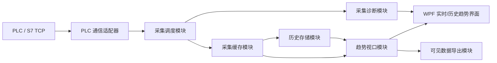

# PIDTuner 项目上下文与需求基线 V2.0

> 用途：作为 PIDTuner V2.0 后续架构设计、任务拆分、代码实现、性能验证和文档维护的长期上下文。  
> 当前版本：v2.0  
> 项目名称：PIDTuner  
> 文档状态：需求与架构目标基线

---

## 1. V2.0 顶层目标

PIDTuner V1.x 已经具备基础项目配置、PLC 通信、点位读取、实时趋势、历史记录加载和实验记录保存能力。V2.0 的重点不再是简单补齐入口功能，而是提升采集链路的可解释性、可诊断性和历史趋势工作台能力。

V2.0 的两个首要目标是：

1. 采集链路效率可度量  
   当 PLC 侧变量以 10Hz 或更高频率变化、PIDTuner 以 100ms 等周期采集时，软件必须能记录并展示采样偏移、调度延迟、PLC 响应耗时、TCP 往返耗时、缓存入队耗时、UI 刷新延迟和绘图刷新节奏。PC 软件侧不承诺硬实时采样，但必须让误差来源可观测、可复现、可比较。

2. 历史趋势工作台增强  
   历史趋势模式必须是静态曲线，不跟随实时刷新。用户可以在历史数据中选择时间范围，缩放和平移 X 轴/Y 轴，显示或隐藏曲线，并导出当前画布可见范围的数据为 CSV。交互体验应逐步向 `WPFHistoricalTrend` 项目中成熟的历史/实时趋势工作台靠齐。

---

## 2. V2.0 架构原则

V2.0 应继续保持分层架构，同时把采集、缓存、趋势和导出拆成更清晰的深模块：



架构方向：

- PLC 通信、采集调度、数据缓存、UI 刷新、历史存储、趋势导出应由不同模块承担。
- 实时采集线程与 UI 绘图刷新解耦，UI 不应决定 PLC 读取节奏。
- PLC 点位批量读取优先按 DB 块聚合读取，减少 S7 请求往返次数。
- 采集帧必须记录计划采样时间、实际请求时间、响应时间、入缓存时间、UI 展示时间等诊断信息。
- 趋势图渲染应读取缓存或历史存储中的数据快照，而不是在绘图路径中直接触发 PLC 读取。

---

## 3. 模块需求

### M1 采集链路诊断模块

#### 目标

让采集链路中的时间偏移和性能瓶颈可观测，支持判断问题来自 PLC 响应、TCP 传输、C# 线程调度、缓存写入、UI Dispatcher 或图表绘制。

#### 当前问题

- 100ms 采样并不等于精确在 100ms、200ms、300ms 等时刻取样。
- 曲线不光滑时，无法判断是 PLC 变量变化、读取延迟、线程调度抖动还是 UI 刷新造成。
- 不同数据往返回合且可复现性不强，缺少采集帧级别的诊断证据。

#### 功能需求

- 每个采集帧记录计划采样时间、实际请求发起时间、PLC 响应完成时间、解析完成时间、缓存写入时间、UI 可见时间。
- 计算调度延迟、PLC 读取耗时、请求间隔、帧间隔、缓存延迟、UI 延迟。
- 统计 P50/P95/P99 延迟、最大延迟、丢帧数、超时数、连续迟到次数。
- 在界面中提供简明诊断摘要，并允许导出诊断明细。

#### 架构要点

- 使用单调时钟记录链路时间，例如 `Stopwatch.GetTimestamp()`。
- 诊断数据跟业务采样值同帧保存，但 UI 展示可以聚合。
- 诊断模块不直接依赖 WPF 控件，也不直接依赖 S7 客户端实现。

#### 输入/输出

- 输入：采集计划、PLC 读取开始/结束事件、缓存写入事件、UI 渲染事件。
- 输出：采集帧诊断记录、周期统计摘要、异常分类结果。

#### 关键状态

- `Normal`：采样延迟在预期范围内。
- `Late`：采样晚于计划时间但仍成功。
- `Timeout`：PLC 读取超时。
- `Dropped`：采集帧被跳过或未写入缓存。
- `UiLagging`：采集正常但 UI 展示明显滞后。

#### 验收标准

- 连续采集 60s 后能导出每一帧的计划时间和实际时间。
- 能区分 PLC 读取耗时过长与 UI 刷新过慢。
- 100ms 采样配置下能展示帧间隔分布和 P95 调度延迟。

#### 与 V1.x 的关系

V1.x 已有基础实时读取和反馈信息。V2.0 在此基础上增加链路级诊断，不改变用户配置 PLC 点位的基本流程。

---

### M2 高效 PLC 批量读取模块

#### 目标

提升多点读取效率，减少对 PLC 的重复请求，让多点趋势数据尽可能来自同一次或少数几次连续读取。

#### 当前问题

- 多点读取如果逐点发起请求，会增加 TCP 往返和 PLC 响应负担。
- S7 多变量批量读取已经可用，但对高频趋势来说仍需要进一步优化请求组织。
- 相邻或同 DB 点位可以通过连续 DB 块读取减少协议开销。

#### 功能需求

- 根据点位地址解析 DB 编号、偏移、数据类型和字节长度。
- 将同 DB 且地址接近的点位聚合为连续块读取。
- 支持无法聚合的点位回退到多变量读取或单点读取。
- 批量读取结果必须保留每个点位的质量状态和错误信息。
- 支持记录每批读取的点位数量、请求字节数、响应字节数和耗时。

#### 架构要点

- 地址解析与读取执行分离，地址解析结果应可被测试。
- 聚合策略作为通信适配器内部实现，对上层只暴露“读取一组点位”的接口。
- 单点读取、多变量读取、连续块读取都应返回统一采样帧。

#### 输入/输出

- 输入：启用点位列表、PLC 连接配置、采样计划。
- 输出：同一采集时刻的一组点位值、质量状态、批量读取诊断信息。

#### 关键状态

- `BlockRead`：使用连续 DB 块读取。
- `MultiItemRead`：使用 S7 多变量读取。
- `SingleReadFallback`：降级为单点读取。
- `PartialFailure`：部分点位读取失败。
- `BatchFailure`：整批读取失败。

#### 验收标准

- 多个同 DB 相邻点位优先合并为一次块读取。
- 部分点位失败时，成功点位仍可进入采样帧，并标明失败点位。
- 批量读取失败时，反馈信息能区分地址解析错误、PLC 响应错误、payload 截断、连接中断和超时。

#### 与 V1.x 的关系

V1.x 已解决基础多点 S7 批量读取 payload 截断问题。V2.0 继续把多点读取从“能读”推进到“高效、可诊断、可降级”。

---

### M3 采集调度与缓存模块

#### 目标

建立独立于 UI 的采集调度和内存缓存，让采集周期、数据记录和绘图刷新互不阻塞。

#### 当前问题

- 用户观察到采样频率设置与实际曲线更新频率之间可能存在差异。
- UI 刷新不应该代表真实采集频率。
- 高频采集时如果每帧都立即触发绘图，会放大 UI Dispatcher 和图表渲染压力。

#### 功能需求

- 采集调度基于绝对计划时间运行，例如 `t0 + n * interval`。
- 采集数据先写入内存缓存，再由 UI 以独立刷新频率读取快照。
- 缓存应支持按时间窗口读取、按点位读取、按批次读取。
- 缓存应保留采样值、质量状态和诊断字段。
- 支持配置最小采样周期、默认采样周期和 UI 最大刷新频率。

#### 架构要点

- 采集循环运行在后台任务中，使用取消令牌控制生命周期。
- UI 只订阅读取后的缓存快照，不直接控制 PLC 读取节奏。
- 缓存模块是实时趋势和历史存储之间的接口。

#### 输入/输出

- 输入：采样周期配置、启用点位、PLC 读取结果。
- 输出：时间序列缓存、当前窗口快照、待持久化采样批次。

#### 关键状态

- `Idle`：未采集。
- `Running`：正在按计划采集。
- `Stopping`：正在停止并清理资源。
- `Recovering`：读取异常后恢复。
- `Backpressure`：缓存或持久化速度低于采集速度。

#### 验收标准

- 采集线程在 UI 卡顿时仍能继续记录采样帧。
- 100ms 采集和 250ms UI 刷新可以同时存在，且诊断中能看出差异。
- 停止采集后缓存中的最后一批数据不会丢失。

#### 与 V1.x 的关系

V1.x 已有实时监控和 1s 记录功能。V2.0 将其扩展为长期运行的采集调度和缓存基础能力。

---

### M4 实时趋势显示模块

#### 目标

实时趋势只负责展示最近时间窗口中的数据变化，保持流畅、稳定、低干扰。

#### 当前问题

- 趋势图应成为实时监控页面的中心，而不是点位配置表格的附属展示。
- 图表刷新频率和采集频率容易被用户混淆。
- 高频采集下，实时绘图如果不降采样或节流，可能影响 UI 响应。

#### 功能需求

- 显示最近 N 秒的数据窗口。
- 支持暂停/恢复实时滚动。
- 支持曲线显示/隐藏、图例、基础游标读值。
- 明确显示采集频率、UI 刷新频率和当前帧延迟摘要。
- 实时模式下新增数据自动进入当前窗口。

#### 架构要点

- 实时图表从缓存读取窗口快照。
- 图表适配器负责渲染和降采样，避免 ViewModel 处理绘图细节。
- UI 刷新使用节流策略，不阻塞采集循环。

#### 输入/输出

- 输入：内存缓存窗口、趋势配置、曲线可见状态。
- 输出：实时趋势画面、游标读值、当前窗口统计信息。

#### 关键状态

- `LiveScrolling`：实时滚动。
- `LivePaused`：实时采集继续，但图表暂停滚动。
- `Disconnected`：PLC 未连接或采集已停止。
- `RenderingLag`：图表刷新落后于缓存。

#### 验收标准

- 用户能明确区分采集频率和画面刷新频率。
- UI 暂停滚动时不影响后台采集。
- 高于 UI 刷新频率的数据仍进入缓存和历史存储。

#### 与 V1.x 的关系

V1.x 已在实时监控页提供实时/历史切换入口。V2.0 继续强化实时趋势的可解释性和显示性能。

---

### M5 历史趋势工作台模块

#### 目标

提供静态历史趋势查看能力，让用户可以像使用趋势工作台一样查看、缩放、平移、对比和定位历史数据。

#### 当前问题

- 历史趋势不应复用实时滚动逻辑。
- 用户需要自由选择历史区间，而不是只能回放固定的记录帧。
- 需要向 `WPFHistoricalTrend` 项目的成熟交互能力靠齐。

#### 功能需求

- 进入历史趋势模式后，曲线保持静态，不跟随实时采集滚动。
- 支持按时间范围加载历史数据。
- 支持 X 轴缩放和平移。
- 支持 Y 轴缩放和平移，并支持自动适配当前可见数据范围。
- 支持多曲线显示/隐藏。
- 支持游标查看某一时刻的多点值。
- 支持从历史模式切回实时模式。

#### 架构要点

- 历史趋势读取历史存储或已加载记录，不直接读取 PLC。
- 趋势视口保存当前 X/Y 轴范围、可见曲线和选中时间范围。
- 历史趋势和实时趋势共享渲染适配器，但使用不同的数据源和视口状态。

#### 输入/输出

- 输入：历史数据源、查询时间范围、曲线选择、视口操作。
- 输出：静态历史趋势画面、当前可见范围、当前游标值。

#### 关键状态

- `HistoryEmpty`：未加载历史数据。
- `HistoryLoaded`：已加载历史数据。
- `ViewportChanged`：用户调整了 X/Y 轴范围。
- `SelectionActive`：用户选中了时间区间。
- `ExportReady`：当前画布可见数据可导出。

#### 验收标准

- 历史模式下新采集数据不会推动当前曲线滚动。
- 用户缩放 X/Y 轴后，画布保持所选范围。
- 从实时切换到历史、再切回实时时，两种模式状态不互相污染。

#### 与 V1.x 的关系

V1.x 已能加载 PLC 记录并在趋势图上显示历史数据。V2.0 将其从“历史展示”升级为“历史趋势工作台”。

---

### M6 画布可见数据导出模块

#### 目标

支持将当前历史趋势画布中可见的数据导出为 CSV，导出的不是全量历史，而是用户当前正在查看的区间。

#### 当前问题

- 用户需要把选定区间的数据带到 Excel、MATLAB 或报告中继续分析。
- 全量导出容易包含无关数据，不利于复盘当前画布中的问题。

#### 功能需求

- 导出当前 X 轴可见范围内的数据。
- 只导出当前可见曲线对应的点位。
- CSV 包含采样时间、点位名称、地址、值、单位、质量状态和诊断字段。
- 导出完成后在界面反馈信息中显示绝对保存路径。
- CSV 使用 UTF-8 BOM，降低中文字段在 Excel 中乱码的概率。

#### 架构要点

- 导出模块依赖趋势视口和数据源接口，不依赖图表控件像素。
- 导出逻辑复用现有 CSV 编码策略。
- 可见范围由趋势视口提供，而不是由 UI 文本框重复计算。

#### 输入/输出

- 输入：当前趋势视口、历史数据源、可见曲线列表。
- 输出：CSV 文件、导出结果反馈。

#### 关键状态

- `NoVisibleData`：当前画布范围内无数据。
- `Exporting`：正在导出。
- `ExportSucceeded`：导出成功。
- `ExportFailed`：导出失败。

#### 验收标准

- 缩放到某个历史区间后，导出的 CSV 只包含该区间内可见曲线数据。
- 导出反馈中展示绝对路径。
- 中文列名和中文点位名称在 Excel 中打开不乱码。

#### 与 V1.x 的关系

V1.x 已解决 CSV 导出乱码问题，并在操作反馈中展示保存路径。V2.0 将这些能力复用于历史趋势画布导出。

---

### M7 性能指标与验收模块

#### 目标

为 V2.0 的采集效率和历史趋势能力建立可执行验收标准，避免只凭肉眼观察判断效果。

#### 当前问题

- 目前曲线是否光滑主要靠肉眼观察。
- 采集周期、PLC 响应、UI 刷新之间缺少量化验收。
- 历史趋势交互是否达到工作台级别需要明确标准。

#### 功能需求

- 提供采集诊断报告。
- 提供固定时长采集测试，例如 60s、10Hz、20Hz。
- 记录帧数、实际采样间隔分布、P95/P99 延迟、超时次数。
- 对历史趋势缩放、平移、导出建立回归测试或手工验收清单。

#### 架构要点

- 性能验收数据来自诊断模块，不从 UI 文本反推。
- 自动化测试覆盖可测试的纯逻辑模块，例如地址聚合、视口范围计算、CSV 可见数据导出。
- PLC 真实链路测试作为现场验收清单保留。

#### 输入/输出

- 输入：采集运行记录、历史趋势操作、导出请求。
- 输出：诊断报告、测试结果、现场验收记录。

#### 关键状态

- `Pass`：达到验收阈值。
- `Warning`：功能可用但存在延迟或丢帧风险。
- `Fail`：未达到配置采样能力或历史趋势操作错误。

#### 验收标准

- 100ms 配置下连续采集 60s，实际帧数和延迟分布可被记录。
- 可导出完整诊断 CSV。
- 历史趋势 X/Y 轴缩放和平移稳定，不影响实时采集状态。
- 画布可见数据导出的时间范围与当前视口一致。

#### 与 V1.x 的关系

V1.x 主要通过功能回归测试验证行为。V2.0 增加性能和现场链路验收，让问题定位更可复现。

---

## 4. 建议实施顺序

1. 采集链路诊断先行  
   先记录每一帧的计划时间、实际时间和各阶段耗时。没有诊断数据时，不应先做大规模性能优化。

2. 多点批量读取优化  
   在已有 S7 多变量读取基础上，实现 DB 块聚合读取和失败分类。

3. 采集调度与缓存重构  
   将采集循环、内存缓存、UI 刷新三者解耦，明确采集频率与绘图刷新频率。

4. 历史趋势工作台  
   建立历史趋势静态视口，支持 X/Y 缩放、平移、曲线显隐、游标读值。

5. 当前画布可见数据导出  
   在历史趋势视口稳定后，实现按当前可见范围导出 CSV。

---

## 5. 非目标

V2.0 当前阶段不优先实现以下内容：

- PLC 控制参数写回。
- 自动 PID 参数整定闭环。
- 复杂报告生成。
- 多品牌 PLC 的完整适配。
- 硬实时采样承诺。

这些能力可以作为后续版本讨论，但不应干扰 V2.0 对采集链路和历史趋势工作台的重点投入。

---

## 6. 配置与数据建议

### 6.1 采集配置

建议配置项包括：

```json
{
  "defaultSamplingMilliseconds": 100,
  "minimumSamplingMilliseconds": 50,
  "uiRefreshMilliseconds": 250,
  "diagnosticsEnabled": true,
  "diagnosticsRetentionSeconds": 300
}
```

说明：

- `defaultSamplingMilliseconds` 表示默认 PLC 采集周期。
- `minimumSamplingMilliseconds` 表示允许配置的最小采样周期。
- `uiRefreshMilliseconds` 表示趋势图最大 UI 刷新频率。
- `diagnosticsEnabled` 控制是否记录链路诊断。
- `diagnosticsRetentionSeconds` 控制内存中诊断明细保留时间。

### 6.2 采集帧字段

建议采集帧至少包含：

```text
FrameId
BatchId
PlannedTimestampUtc
RequestStartedTimestampUtc
ResponseReceivedTimestampUtc
ParsedTimestampUtc
BufferedTimestampUtc
UiPresentedTimestampUtc
TagName
Address
Value
Unit
Quality
ErrorCode
ErrorMessage
ScheduleDelayMilliseconds
ReadDurationMilliseconds
BufferDelayMilliseconds
UiDelayMilliseconds
```

### 6.3 历史存储字段

建议历史存储至少支持：

```text
SampleId
BatchId
TimestampUtc
MonotonicTicks
TagId
TagName
Address
DataType
Value
Unit
Quality
Source
DiagnosticsJson
CreatedAtUtc
```

---

## 7. 验收清单

### 7.1 采集链路

- 能在 100ms 采样配置下连续采集 60s。
- 能看到计划采样时间与实际请求时间的偏移。
- 能看到 PLC 读取耗时和 UI 展示延迟。
- 能区分采集正常但 UI 刷新慢的情况。
- 能导出采集诊断明细。

### 7.2 多点读取

- 同 DB 相邻点位优先块读取。
- 不同 DB 点位可拆分为多个读取批次。
- 部分点位失败不导致整帧全部丢失。
- 失败提示能区分地址解析、连接、超时、PLC 响应和响应解析问题。

### 7.3 实时趋势

- 实时趋势显示最近时间窗口。
- UI 刷新频率低于采集频率时，采集数据仍完整进入缓存。
- 暂停实时滚动不影响采集。

### 7.4 历史趋势

- 历史模式下曲线静止。
- 支持按时间范围加载。
- 支持 X/Y 轴缩放和平移。
- 支持曲线显示/隐藏。
- 支持游标查看多点值。

### 7.5 可见数据导出

- 导出范围等于当前画布 X 轴可见范围。
- 只导出当前可见曲线。
- 导出 CSV 包含必要诊断字段。
- 导出完成反馈展示绝对路径。
- 中文内容在 Excel 中打开不乱码。

---

## 8. 后续讨论入口

后续实现前，应优先讨论并确认以下问题：

1. 采集诊断 UI 的呈现方式：简明状态栏、详细诊断面板、还是独立诊断页。
2. 历史存储介质：继续使用 JSON 记录文件，还是引入 SQLite 作为长期历史数据存储。
3. 历史趋势交互范围：先实现基础 X/Y 缩放和平移，还是同步引入区间选择、游标吸附和多曲线联动。
4. 现场验收阈值：100ms 采样下允许的 P95/P99 调度延迟目标。

本文档作为 V2.0 的需求与架构基线。后续实现说明应在代码落地后更新到 `IMPLEMENTATION_NOTES.zh-CN.md` 和 `IMPLEMENTATION_NOTES.en.md`。
